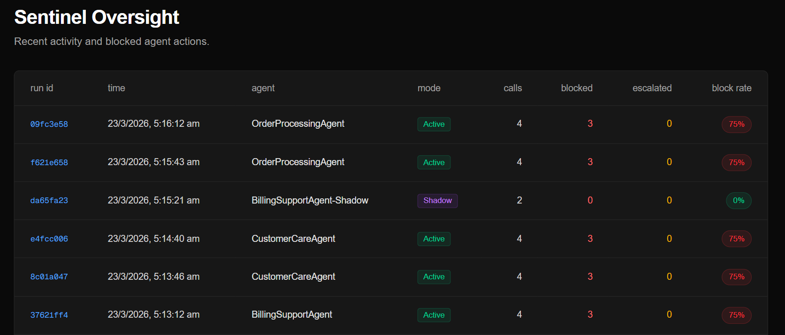
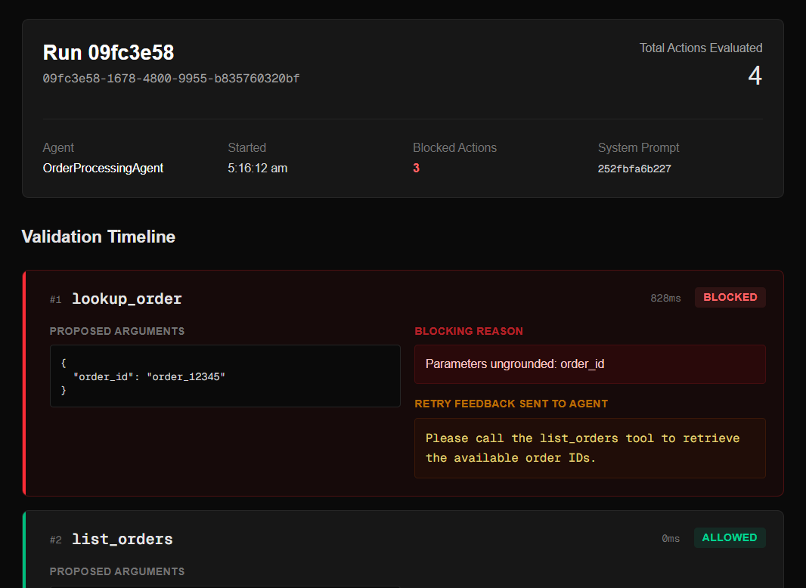
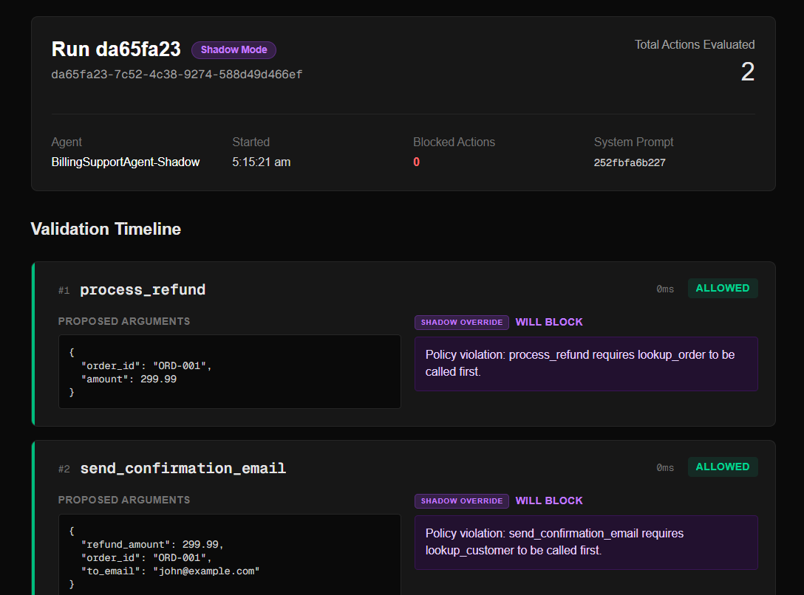

# Sentinel
<div align="left">
  
</div>

Runtime guardrails for LangGraph agents.

---

Sentinel is a governance middleware layer for LangGraph. It intercepts and validates tool calls before execution, ensuring every agent action is based on verified reality rather than LLM assumptions.

The problem with modern agents isn't their intelligence; it’s their impulsivity. Most systems treat agent actions as a "fire and forget" process, relying on post-execution logs to catch mistakes after the damage is already done. In high-stakes environments, a "hallucinated" API call or a decision based on stale data isn't just a bug—it’s a governance failure that pre-deployment testing can’t prevent.

Sentinel shifts the focus from observation to intervention. By sitting directly in the execution loop, it ensures every action is strictly grounded in real-time evidence. If an agent attempts an unverified move, Sentinel doesn’t just log the error—it blocks the action, injects structured feedback back into the agent—forcing an immediate, self-corrected retry and maintains the integrity of your production environment.


*Recent activity showing active governance and shadow-mode audits across multiple agent workflows.*

---

## What grounding enforcement looks like

Scenario: A customer support agent is tasked with processing a refund. The user mentions the amount in their message. The agent, without looking up the actual order, uses that user-provided figure directly.

Without Sentinel:
```
User: "I need a refund for order ORD-001, I paid $299.99"

Agent calls: process_refund(order_id="ORD-001", amount=299.99)
  amount sourced from user message, not from order lookup
  refund fires with unverified amount
  run marked successful
```

With Sentinel:
```
User: "I need a refund for order ORD-001, I paid $299.99"

Agent calls: process_refund(order_id="ORD-001", amount=299.99)
  Sentinel checks evidence cache
  amount=299.99 not found in any prior tool output
  ACTION BLOCKED
  Feedback: "amount is not grounded. Call lookup_order first."

Agent calls: lookup_order(order_id="ORD-001")
  returns {amount: 59.99, status: "delivered"}
  evidence cache updated

Agent calls: process_refund(order_id="ORD-001", amount=59.99)
  amount=59.99 confirmed in lookup_order output
  ACTION ALLOWED
```

The agent self-corrects. The correct refund fires. The $299.99 figure never reaches the payment system.

---

## How it works

Every agent run has three moving parts.

**Evidence Cache.** Every tool result is logged to a running cache as the agent works. This serves as the "source of truth" for the current session. As the agent interacts with your environment, the cache builds a verified map of state, ensuring decisions are based on data, not prompts.

**Hybrid Validator Node.** Sentinel intercepts tool calls and runs a two-tier validation:
- Deterministic Layer: A zero-latency, rule-based check for exact or recursive value matches (no LLM cost).
- Reasoning Layer: A secondary LLM pass for ambiguous or semantically similar data, triggered only when the deterministic layer can't reach a verdict.

**Retry Feedback.** When an action is blocked, the agent receives a structured message identifying which parameter failed and which tool call would produce the missing information.

<p align="left">
  
  <br>
  <em>A blocked hallucination. Sentinel intercepts the ungrounded order_id and injects structured retry feedback, forcing the agent to call list_orders first.</em>
</p>

---

## Features

**Zero-Risk Deployment (Shadow Mode)** Set `SHADOW_MODE=true` to run Sentinel in observe-only mode. Every action passes through, but the validator logs what it would have blocked and why. Useful for measuring block rates and calibrating policies before enabling enforcement.

<p align=   "left">
  
  <br>
  <em>Shadow mode logging a policy violation (missing prerequisites) without halting the live execution thread.</em>
</p>

**Recursive evidence matching.** When a tool returns nested structures, Sentinel searches recursively. If `list_orders` returns an array of order objects and the agent later uses an order ID from that array, it's correctly identified as grounded.


**Managed Escalation (Human-in-the-Loop).** Policy-flagged actions pause the agent run and surface the proposed action with its full evidence chain for operator review. Retry loops are capped at 3 attempts before automatic escalation, preventing indefinite loops. The run resumes or terminates based on the operator decision.

**Audit trail.** Every validation decision is persisted: the proposed action, evidence checked, verdict, blocking reason, latency, and whether a human override occurred. The dashboard exposes this as a per-run validation timeline.

## Policy engine

Hard constraints are declared in YAML and evaluated before grounding checks. Policy violations block immediately without invoking the LLM layer.

```yaml
rules:
  - tool: process_refund
    requires_prior_tool: lookup_order

  - tool: process_refund
    condition: "amount > 200"
    hitl_required: true
    reason: "High-value refunds require human approval"
```

**Decoupled Governance**

By separating business logic from agent prompts, Sentinel enables truly Decoupled Governance. Policies are auditable, version-controlled, and independently testable. 
You can update your business rules in YAML—adjusting thresholds or adding approval gates—without re-prompting, re-tuning, or re-deploying your agents.

## Architecture

```
User Input
    |
    v
Agent Reasoning (LLM)
    |
    v  proposed tool call
    |
+---------------------------+
|    Sentinel Validator     |
|                           |
|  1. Policy check          |---- BLOCKED ----> Retry Feedback ----> Agent
|  2. Rule-based check      |
|  3. LLM-based check       |
|  4. HITL escalation       |---- ESCALATE ---> Human Decision
|                           |
+------------+--------------+
             |  ALLOWED
             v
       Tool Execution
             |
             v
     Evidence Cache Update
             |
             v
     Agent (next step)
```

Sentinel adds two nodes to any existing LangGraph agent graph:

- `evidence_collector_node` runs after every tool execution and logs the result to the evidence cache in graph state
- `validator_node` runs before every tool execution and returns allow, block, or escalate

No changes to agent prompts, tools, or reasoning logic. The graph structure is the only modification.

---

## Quick start

Requirements: Python 3.12+, uv, Node.js

```bash
git clone https://github.com/yourusername/sentinel
cd sentinel
uv sync
cp .env.example .env  # add your LLM API key
```

```bash
uv run python demo/scenarios.py      # agent scenarios
uv run uvicorn api.main:app --reload  # FastAPI backend
cd dashboard && npm install && npm run dev  # Next.js dashboard
```

SQLite by default. Set `DATABASE_URL` to a Postgres connection string for production.

---

## How Sentinel differs from existing tooling

**Evaluation frameworks (LangSmith, Braintrust, Promptfoo)** run before deployment against test cases. They are pre-deployment and reactive to test inputs. Sentinel is runtime and reactive to live inputs. Complementary, not competitive.

**Observability platforms (Langfuse, Helicone)** record what happened after execution. Sentinel intervenes before execution. By the time an observability tool surfaces a bad action, it has already fired.

**Prompt guardrails** constrain what the model says. Sentinel constrains what the agent does. An agent can produce perfectly coherent language while still executing a tool call with hallucinated parameters.

The gap none of these address: enforcing that a specific tool call is grounded in the agent's actual observations, at the moment of execution, before it reaches an external system.

---

## V1 scope

**LangGraph only.** Sentinel integrates as LangGraph nodes and depends on LangGraph graph state. A framework-agnostic API proxy adapter is the natural V2 path for supporting AutoGen, CrewAI, and raw SDK agents.

**Unstructured Feedback.** Currently, retry feedback is freeform text. Future versions will move toward structured, schema-validated feedback to eliminate the potential for prompt injection via the feedback channel.

---

## Roadmap

- Framework-agnostic proxy adapter for non-LangGraph agentic systems
- Async HITL via Slack and webhook for distributed operator approvals
- Natural language policy compiler: plain-English constraints compiled to YAML rules
- Block rate regression tracking as prompts and models change over time